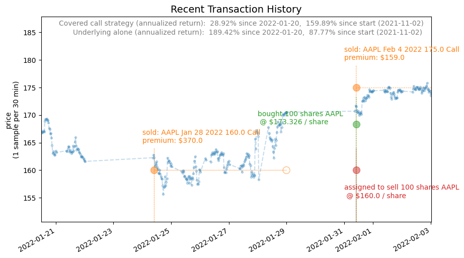
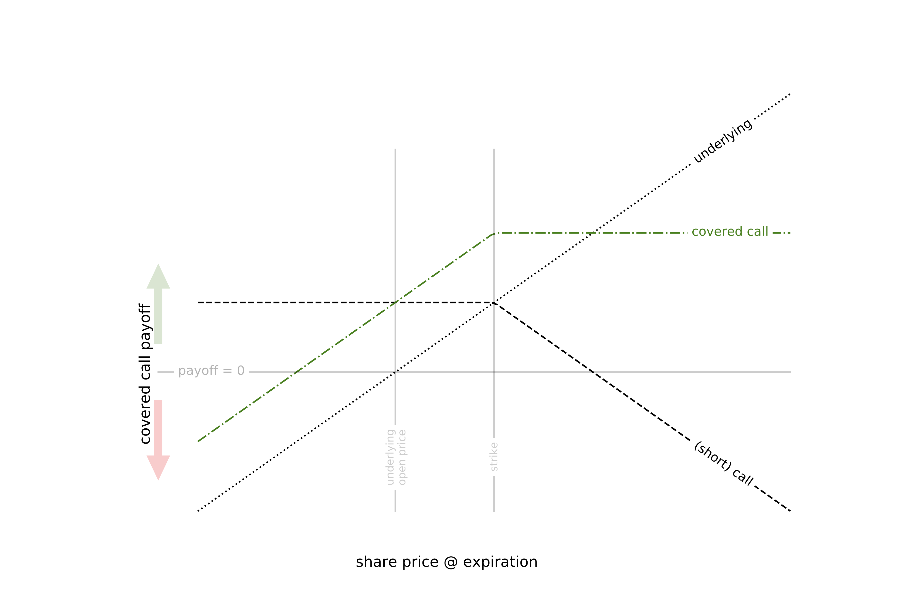

### What is this?
I made this site mostly for myself.  I wanted to document all the thinking that went into this project, and compile it in one place.  This site is that documentation.

The "covered calls" strategy is not new—it's a well-known options strategy that comprises selling an option against shares that I already own.  For details, see [Strategy](https://arkm97.github.io/covered-calls/strategy-details/)

### Why do this?
I'm aware there are better trading strategies out there.  I'm sure there are plenty of easier ways to make money.

I did this project for fun.  Also to learn some interesting math.  Faced with months of downtime during the covid pandemic, I needed something to keep my mind occupied.  As it turns out, an hour here or there each day is a ton of time when all devoted to one project.  I got to learn how to place trades via API calls, got some experience working with securities data, learned how to build an application that interacts with other applications, and got experience with plenty of SaaS products (like AWS lambda/S3, Heroku, mailgun, Github, etc.).  It is a nice added benefit that what I've built makes money, but that wasn't the sole motivation.

### See more
<figure class="half">
  
  <figcaption><a href="https://arkm97.github.io/covered-calls/strategy-performance/">Live transaction history</a></figcaption>
  
  <figcaption><a href="https://arkm97.github.io/covered-calls/strategy-details/">Strategy details</a></figcaption>
</figure>

  

### About me
See this project and others on [my GitHub](https://github.com/arkm97)
