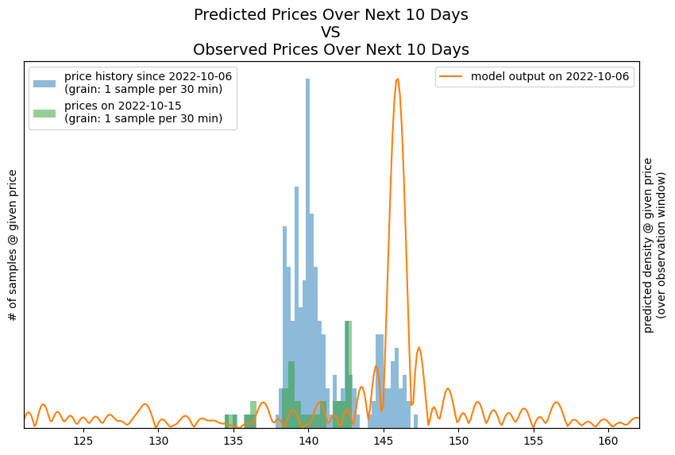
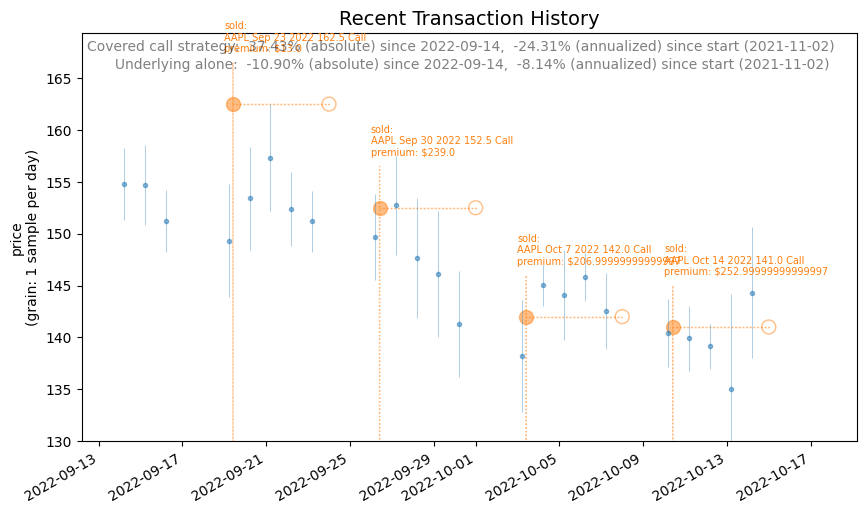

### Model performance
There are a few ways to measure the performance of the predictive model.  One way is to compare the predicted probabilities for prices over some time window in the future and compare it to the observed prices over the same window.  Here is a histogram of the 10 day price history and the predicted probability density that was made 10 days ago:

<figure class="half">
    
</figure>

### Strategy performance
What trades have I actually made recently? Is the strategy making money?  Is it making more than if I simply held the underlying shares and never sold them or any options? Here's a visual:
<figure class="half">
    
</figure>
