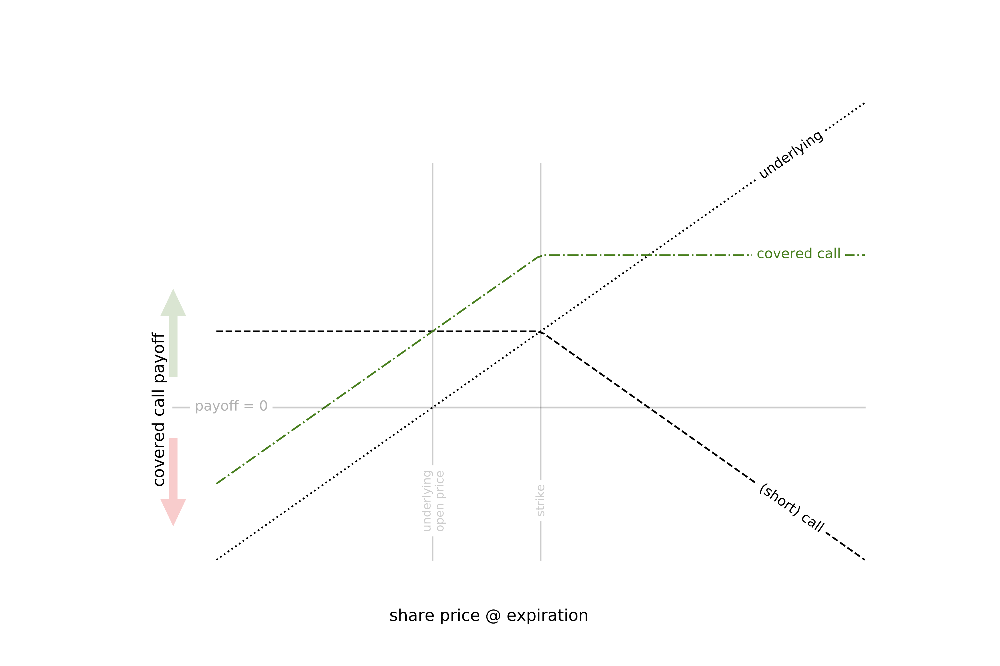

### covered call basics
In breif: the transaction of interest in this strategy is the sale of a call option while long 100 shares of the underlying security.  The call gives a buyer the right to buy 100 shares at a certain price (the strike price) on or before a certain date (the expiration date).  If the underlying share price is above the strike at expiration, the buyer can exercise the right to buy and make immediate profit.  The buyer pays a premium to enter the contract.  

If the buyer decides to exercise the option, I can fullfill the sale at the strike price using the 100 shares I already own. This avoids having to first buy 100 shares at the market price.  The combined underlying & short call position thus has limited exposure to upward moves by the underlying security (it is "covered"). On the other hand, the position has essentially the same exposure to downward moves as a simple long position.

The payoff looks like this: 

### the strategy
(t -1) Buy 100 shares of the underlying stock

(t0) Write an OTM call (i.e. sell the call contract where the strike is greater than the current share price, hence "**O**ut of **T**he **M**oney") and collect the premium.  

(t1)
If the share price is less than the strike, the option expires worthless and I keep both the shares and the premium.  I can immediately write another OTM call on the same 100 shares.
If the share price is greater than the strike, I keep the premium but must sell the underlying 100 shares.  I then reopen the underlying position and can write another OTM call against those shares.  

### when the strategy wins 
The goal is to gain more from the premium than I give up if the underlying price increases—at least on average.  The premium increases with time to expiration and expected future volatility and decreases the further the strike price is from the current underlying share price.  The strategy is technically profitable when the underlying price decreases slightly, stays the same, or increases slightly.  However, the premium should be priced to reflect the market's expectation about these small moves, likely making the covered call a 0 EV bet.  The strategy is actually profitable when the volatility realized at expiration is lower than what was expected when the call was written.  This is difficult to predict.

Further, even if the expected value of the trade is positive, the variance of the payoff may still lead to ruin after a few rounds of written calls.  What really makes the strategy profitable long term is risk control—that means taking bets where the variance of the payoff is small enough that successive losses don't quickly compound and leave me without enough money to buy 100 shares.

### picking winners
In order to decide whether or not to make the trade, I need to estimate both the payoff and the variance of the payoff.  If the expected payoff is negative or the (estimated) variance is outside my risk tolerance, I won't sell the call.  The expected payoff condition is straightforward.  The variance condition is set by a numerical simulation that answers roughly the following: "what level of variance in payoff can I accept in order to expect less than X% chance of ruin in t years."  

These estimates both require a prediction about future volatility.  Learn more about [model behind the predictions](https://arkm97.github.io/covered-calls/volatility-model/).

With a predicted payoff and predicted payoff variance, I can formulate a strategy like "write the call when expected payoff is positive and variance is less than X".  I can simulate the performance of the strategy with different thresholds X and measure the chance that the strategy loses enough that I cannot reopen the underlying position:

#### How does the strategy perform?
<figure class="half">
  
  <figcaption><a href="https://arkm97.github.io/covered-calls/strategy-performance/">(Live) transaction history & performance</a></figcaption>
</figure>
